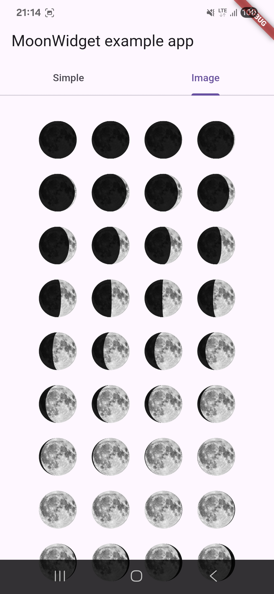
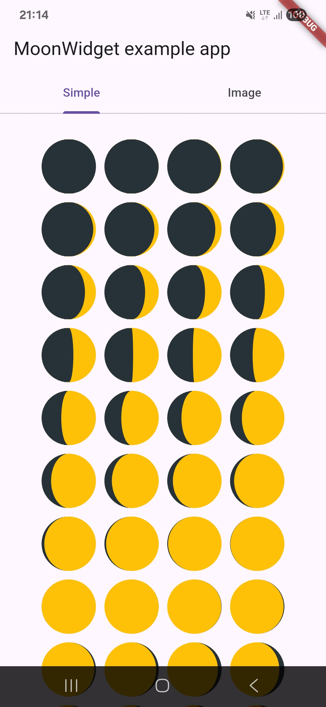

# moon_phase

Flutter plugin that creates moon widgets according to the moon's phase.

<p float="left">
  
  
</p>

## Usage

### Simple (solid colors)
```dart
MoonWidget.simple(
  date: DateTime.now(),
  size: 64,
  moonColor: Colors.amber,
  earthshineColor: Colors.black87,
)
```

### Image (with background)
```dart
MoonWidget.image(
  date: DateTime.now(),
  backgroundImageAsset: 'assets/moon.png',
  size: 64,
  shadowRatio: 0.8,
  earthshineColor: Colors.black87,
)
```

## Parameters

| Parameter | Description |
|-----------|-------------|
| `date` | DateTime to display |
| `size` | Widget size |
| `pixelSize` | Shadow rendering precision (smaller = smoother) |
| `moonColor` | Light side color (simple mode) |
| `earthshineColor` | Dark side color |
| `backgroundImageAsset` | Background image path (image mode) |
| `shadowRatio` | Shadow radius ratio 0.0~1.0 (image mode) |

## Acknowledgements

- [bksubhuti](https://github.com/bksubhuti) - Background image overlay idea

## About

- Publisher - [enoosoft](https://github.com/enoosoft)
- Reference - [Audrius Meskauskas's MoonView](https://github.com/andviane/moon.git)
